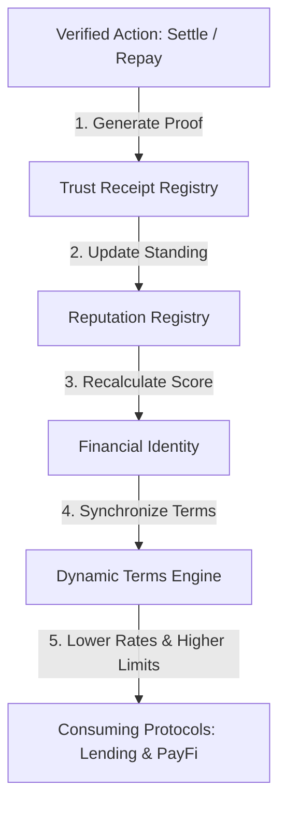

<div align="center">

# 🏦 Credence AI

### **The Trust Layer for Programmable Finance on HashKey Chain**

*Transforming wallet behavior into verifiable financial identity, enabling under-collateralized lending powered by AI.*

[](https://www.hashkey.com/)
[](https://nextjs.org)
[](https://www.typescriptlang.org/)
[](https://soliditylang.org/)
[](#)
[](#)
[](#)
[](#)

### 🚀 Built for **HashKey Chain Horizon Hackathon • AI × DeFi**

[🌐 Live Demo](https://frontend-kohl-psi-76.vercel.app/) •
[📚 Documentation](https://frontend-kohl-psi-76.vercel.app/docs) •
[💻 GitHub](https://github.com/hari-hara-sudharsan/credence-ai)

</div>

---

**Credence AI is the programmable trust infrastructure layer for HashKey Chain, enabling financial applications to verify identity, assess risk, and unlock under-collateralized finance using AI-powered trust intelligence.**

---

# 🌍 Why Credence AI?

DeFi has solved **liquidity**.

It has **not solved trust**.

Today, every borrower is treated almost the same—regardless of years of responsible on-chain behavior.

Traditional finance uses:

- ✅ Credit history
- ✅ Repayment behavior
- ✅ Financial reputation
- ✅ Risk analysis

Web3 has none of these.

---

# 💡 Our Solution

Credence AI introduces a new primitive for DeFi:

## **Programmable Trust**

Instead of asking:

> **"How much collateral do you own?"**

Credence asks:

> **"How trustworthy is your wallet?"**

Wallet activity becomes a portable financial identity.

- 🏆 Trust Score
- 💳 Credit Score
- 🪪 Credit Passport
- 📈 Borrowing Power
- ⭐ Reputation

Trust becomes collateral.

---

# 🔄 Trust Lifecycle

```text
Wallet Activity
      │
      ▼
AI Trust Analysis
      │
      ▼
Credit Passport
      │
      ▼
Loan Eligibility
      │
      ▼
Capital Access
      │
      ▼
Repayment
      │
      ▼
Reputation Growth
      │
      ▼
Higher Borrowing Power
```

---

# ✨ Key Features

## 🤖 AI Underwriting Engine

Transparent and explainable AI underwriting.

### Scoring Factors

| Factor | Weight |
|---------|--------|
| Repayment History | 30% |
| Transaction Reliability | 25% |
| Wallet Age | 20% |
| DeFi Activity | 15% |
| Risk Events | 10% |

### Capabilities

- Explainable AI
- Trust Score Generation
- Credit Score
- Default Risk Prediction
- Loan Eligibility
- Risk Tier Classification

---

## 🪪 Credit Passport

A portable financial identity stored on-chain.

Includes:

- Trust Score
- Credit Score
- Loan History
- Repayment Record
- Reputation Badges
- Streaks
- Risk Tier

---

## 🏆 Universal Financial Identity Layer

A persistent, programmable trust memory layer built directly above the Credit Passport. 
Instead of treating all wallets as homogeneous addresses, Credence constructs unique financial identities classified by actor type and on-chain behavior.

### Supported Entity Classes
* **HUMAN**: Standard user wallets.
* **AI_AGENT**: Automated wallets operating autonomously.
* **DAO**: Multi-sig governance contracts.
* **BUSINESS**: Operations wallets with high transaction frequency.
* **INSTITUTION**: High-volume market maker and lending pool treasury wallets.

### Dynamic DNA & Identity Memory
* **Financial DNA**: Synthesizes five dimensional properties (Trust, Credit, Reliability, Risk, Activity).
* **Reputation Registry Propagation**: Smart contract `FinancialIdentityRegistry` hooks directly to on-chain repayments, defaults, and HSP settlements to adjust credit standing in real-time.
* **Unified APIs**: Exposes REST interfaces `/api/trust/identity/{wallet}`, `/api/trust/dna/{wallet}`, and `/api/trust/history/{wallet}` for external integrations.

---

## 🧾 Verifiable Trust Receipt Layer

A permanent, cryptographic proof registry built to substantiate reputation events. Unlike traditional scoring systems that store mutable integer values, Credence certifies every reputation shift with a signed trust receipt.

### Structure of a Trust Receipt
* **receiptId**: Uniquely indexed registry number.
* **entity**: Recipient wallet.
* **actionType**: Dynamic behavioral flag (`LOAN_REPAID`, `LOAN_DEFAULTED`, `HSP_SETTLEMENT`, `PASSPORT_CREATED`).
* **trustImpact**: Signed impact modifier (`+80`, `-50`, etc.).
* **proofHash**: Deterministic Keccak256 proof hash validating transaction context.
* **issuer**: Contract address generating the receipt.

### Scoring Integration
The integrated Trust Score leverages receipts for deterministic calculations:
`Trust Score = Credit Score + Reputation Score + Verified Receipts Impact`

---

## 🧠 AI Trust Intelligence Layer

A predictive, autonomous risk intelligence agent layer built above the identity registry and trust memory layers. Credence AI does not simply record trust after financial actions occur—it predicts future financial reliability before capital moves.

### Capabilities of the Risk Intelligence Agent
* **Default Risk Forecasting**: Evaluates default probability dynamically based on identity parameters, streak counts, transaction frequencies, and historical trust receipts.
* **Behavior Change Detection**: Compares active trust standing against a running historical baseline to detect immediate behavioral drift (improved consistency or deteriorating liquidity).
* **Financial Action Recommendations**: Produces risk-adjusted suggestions for borrowing limits and lending interest rates.
* **On-Chain Attestation Verification**: AI Trust Reports generate a deterministic `Trust Intelligence Hash` which is signed by oracle keys and verified on-chain via the `OracleRegistry` contract.

---

## 🌐 Composable Trust Infrastructure

Credence is designed to be a fundamental trust network primitive that any HashKey application can consume. Rather than building a closed system exclusively for borrowing, we expose open APIs and SDKs to support arbitrary external financial contexts:

* **Ecosystem Trust Marketplace**: Supports multi-protocol registrations where external dApps can query dynamic wallet matches and record entity activity on-chain.
* **Context-Specific Profiles**: Tailors distinct scoring models for different application contexts (e.g., Voting standing for DAOs, Autonomy validation for AI Agents, Premium discount risks for Insurance, and Verification limits for RWA tokenization).
* **Consensus Oracle Verification**: Delivers verifiable trust reports attested by multiple independent nodes.

---

## 🕸️ HashKey Trust Graph

Credence maps financial relationships across the ecosystem, moving beyond isolated wallet scoring. By constructing a relational graph of nodes (Wallets, AI Agents, DAOs, Protocols, RWAs) and edges (loans, payments, validations), Credence analyzes network-wide behavior and capital efficiencies:

* **Trust Propagation**: Translates on-chain actions like repayments or settlements into positive network trust effects.
* **Risk Intelligence Graph**: Traces default clusters and detects anomalies before risk propagates.
* **Ecosystem Telemetry**: Monitors total trust identities, prevents defaults on-chain, and optimizes capital efficiency.

---

## 🏦 Lending Infrastructure

Supports:

- Under-Collateralized Loans
- Lending Pools
- P2P Lending
- Capital Matching

---

## 🔐 Oracle Verification

Every AI decision is verified on-chain.

Features:

- EIP-712 Signatures
- Replay Protection
- Nonce Validation
- Expiry Verification

---

## 🌐 Developer APIs

Integrate trust into any HashKey application.

```ts
const trust = await Credence.verify(wallet);

if (trust.score > 800) {
    unlockPremiumAccess();
}
```

Available APIs

- Trust API
- Credit API
- Reputation API
- Passport API
- Risk API
- HSP Settlement API

### HSP Settlement API

Manage and execute native HSP economic trust settlements.

- `POST /api/hsp/create`: Register a new HSP settlement request.
- `POST /api/hsp/execute`: Execute native settlement on-chain, update reputation registry, and issue trust receipts.
- `GET /api/hsp/proof/{id}`: Fetch cryptographic proof and trust impact of a settlement.
- `GET /api/hsp/history/{wallet}`: Fetch complete timeline history of verified HSP settlements.

---

# 🏗 Architecture

```text
                    User Wallet
                         │
                         ▼
                Credence AI Frontend
                         │
       ┌─────────────────┼─────────────────┐
       ▼                 ▼                 ▼
 Trust Engine     Credit Passport      Lending
       │                 │                 │
       └─────────────────┼─────────────────┘
                         ▼
              Smart Contract Layer
                         │
      ┌──────────────────┼─────────────────┐
      ▼                  ▼                 ▼
 Oracle Registry   Settlement Layer   Reputation
                         │
                         ▼
                   HashKey Chain
```

---

# 📜 Smart Contracts

| Contract | Purpose |
|----------|---------|
| GovernanceRegistry | Protocol Governance |
| CreditPassportV2 | Financial Identity |
| OracleRegistry | AI Verification |
| LoanManager | Loan Lifecycle |
| LendingPool | Liquidity Layer |
| SettlementManager | Settlement |
| ReputationRegistry | Reputation Engine |

---

## Contract Addresses

| Contract | Address |
|-----------|---------|
| GovernanceRegistry | `0x98297dF9f8ffC79bc8e6BA3Ec606136adacb6f81` |
| CreditPassportV2 | `0xD6b040736e948621c5b6E0a494473c47a6113eA8` |
| OracleRegistry | `0x2Dd78Fd9B8F40659Af32eF98555B8b31bC97A351` |
| LoanManager | `0x2988f0bE02e1a679430aEb4A6B9B10429F1e8e80` |
| LendingPool | `0x928BA9D30669c41695422a68a1C307a6529F0050` |
| SettlementManager | `0x4f3eEE789936a0eca627484bf680464f2F37b9FB` |
| ReputationRegistry | `0x110e9fB1ABEc92521E4511d5f45B4917B4c941Ab` |

---

# 🔗 HashKey Integration

HashKey provides

- Assets
- Payments
- Settlement

Credence adds

- AI Underwriting
- Reputation
- Trust Infrastructure
- Credit Layer
- Financial Identity

Together they enable programmable finance.

---

# 🔒 Security

| Feature | Status |
|----------|--------|
| Access Control | ✅ |
| Role-Based Permissions | ✅ |
| Reentrancy Protection | ✅ |
| SafeERC20 | ✅ |
| Pausable Contracts | ✅ |
| EIP-712 Verification | ✅ |
| Replay Protection | ✅ |
| Expiry Validation | ✅ |

---

# ⚙ Technology Stack

## Frontend

- Next.js 15
- React
- TypeScript
- TailwindCSS
- ShadCN UI
- Framer Motion
- Recharts

## Backend

- FastAPI
- Node.js
- Python
- REST APIs

## AI

- Gemini
- Explainable AI
- Trust Engine
- Risk Prediction

## Blockchain

- Solidity
- Hardhat
- HashKey Chain
- Ethers.js
- MetaMask

## Storage

- PostgreSQL
- On-chain Registry
- Analytics Engine

---

# 🚀 Quick Start

## Clone Repository

```bash
git clone https://github.com/hari-hara-sudharsan/credence-ai.git

cd credence-ai
```

## Frontend

```bash
cd frontend

npm install

npm run dev
```

## Backend

```bash
cd backend

pip install -r requirements.txt

uvicorn main:app --reload
```

---


# 📊 Impact

| Capability | Status |
|------------|--------|
| AI Underwriting | ✅ |
| Credit Passport | ✅ |
| Lending Infrastructure | ✅ |
| Reputation Engine | ✅ |
| Trust APIs | ✅ |
| Production Security | ✅ |

---

# 🏛️ Architecture & Vision

### 1. What problem does Credence AI solve?
Web3 lacks a composable trust identity layer, forcing lending protocols to require heavy over-collateralization. Opaque credit assessments lock capital efficiency.

### 2. Why AI?
Dynamic behavioral intelligence is needed to forecast default probability. Machine learning computes credit risk, streaks, and reliability indicators in real time instead of relying on rigid, historical credit histories.

### 3. Why blockchain?
Financial identity must be owned by the user, censorship-resistant, and verified cryptographically. Storing attestations as EIP-712 signatures prevents single points of failure.

### 4. Why HashKey?
HashKey Chain is the premier compliant EVM gateway for institutional capital and digital assets. It provides the high-performance transaction layer where cross-protocol trust can propagate at scale.

### 5. Why Credence?
Credence bridges the gap between capital demand and security, mapping relationships across the ecosystem into a unified Trust Graph.

```
  Applications
       │
       ▼
  Credence API & SDK
       │
       ▼
  Trust Intelligence (AI Underwriter)
       │
       ▼
  Verification Contracts (TrustVerifier)
       │
       ▼
  HashKey Chain (Cancun EVM)
```

---

# 🌀 The Credence Trust Flywheel

Credence does not only measure trust. It implements a self-improving trust flywheel where verified behaviors increase reusable financial opportunities across the entire HashKey Chain ecosystem:



- **Universal Identity**: Every financial interaction upgrades a single on-chain credit passport.
- **Dynamic Terms**: Lowers interest rates and collateral requirements in real-time as users settle outstanding commitments.
- **Protocol Composability**: Independent consumer apps query the same verified trust ratings, ensuring complete economic capital efficiency.

---

# 🎯 Vision

> **Every wallet deserves a financial identity.**

Credence AI transforms trust into a reusable on-chain asset, enabling under-collateralized lending and powering the next generation of programmable finance across HashKey Chain.

---

<div align="center">

## ⭐ Trust becomes collateral.

### **Credence AI — The Trust Layer for Web3 Finance.**

Built with ❤️ for the **HashKey Chain Horizon Hackathon**

</div>
