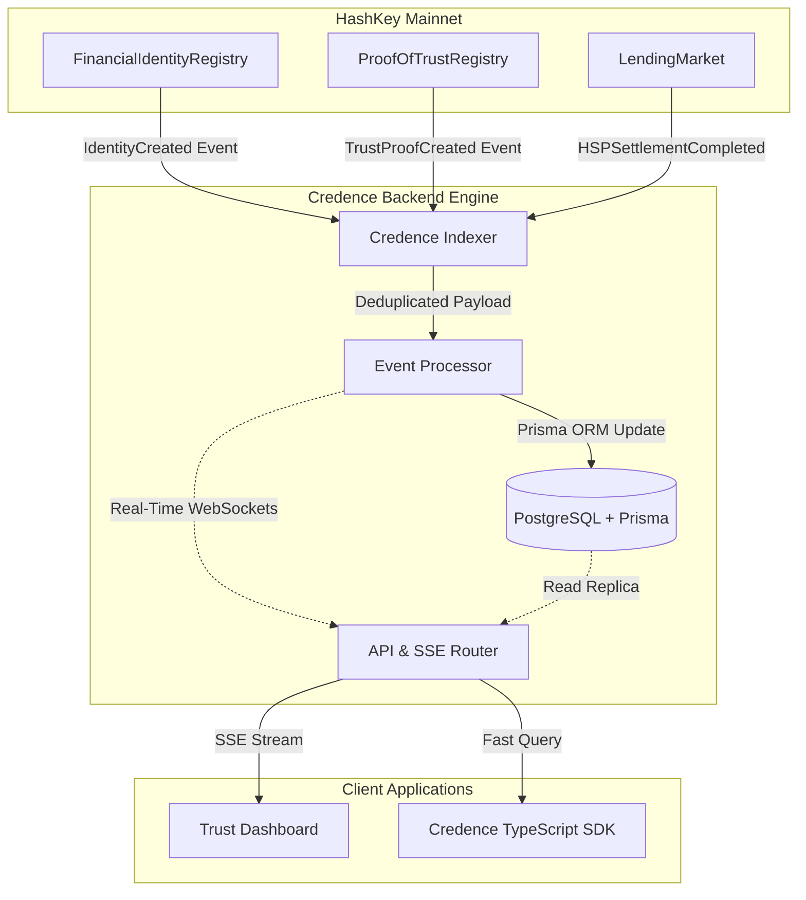

# Credence AI Production Pipeline Architecture

Credence transitions from a standalone smart contract protocol into a full-stack financial infrastructure platform running seamlessly on the HashKey Chain.

## System Diagram

## Prisma Database Schema

The foundational PostgreSQL schema guarantees relational integrity:
- **FinancialIdentity:** Immutable record of verified users and trust tiers.
- **TrustEvent:** Atomic trust actions (payments, verifications) used to compute dynamic scores.
- **Settlement:** HSP records providing real value to the reputation graph.
- **IndexerState:** Ensures perfect block synchronization and rollback capabilities during chain reorganizations.

## High Availability & Scaling Plan
- **Horizontal Scaling:** API instances sit behind a load balancer and read directly from PostgreSQL read replicas.
- **Deduplication:** A unique `EventID` (`chainId-txHash-logIndex`) is enforced at the database layer.
- **Real-Time:** WebSockets (SSE) push updates strictly to subscribed wallets, saving client query bandwidth.
